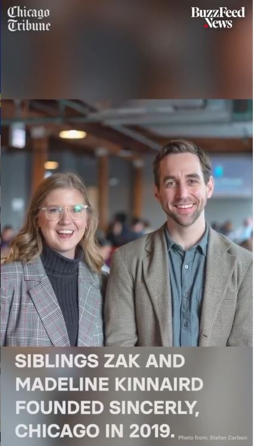

# Sincerely-Chicago
In 2019, I started a monthly voter turnout event organizing volunteers to send handwritten letters and voter registration forms to key races across the country. We worked with individual campaigns, VoteForward, and SwingLeft. This repository is to analyze the effects letter writing had on 2020 voting outcomes.

 

