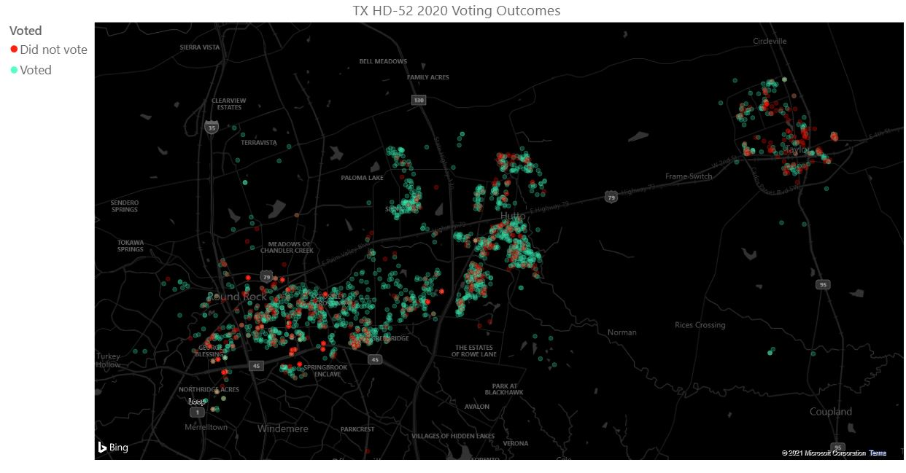
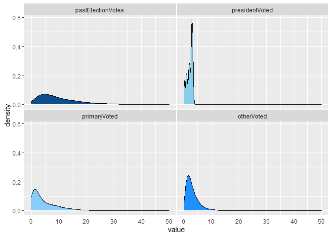
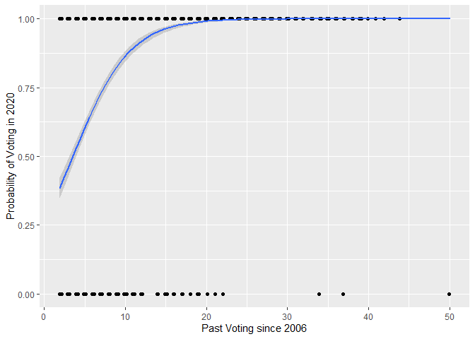
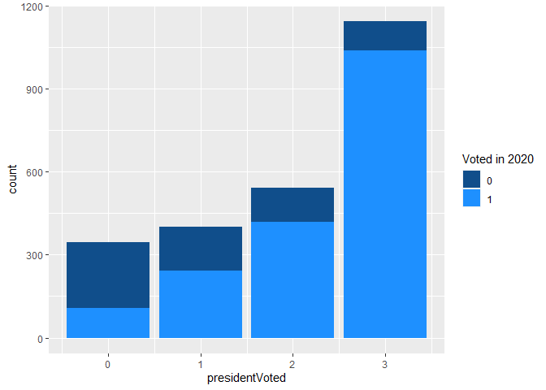
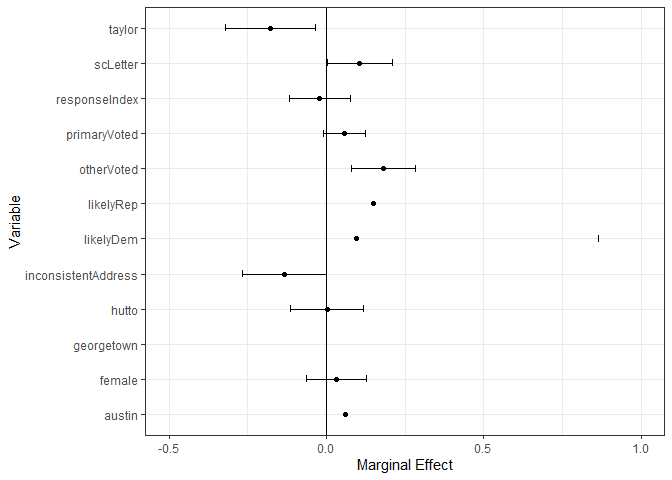
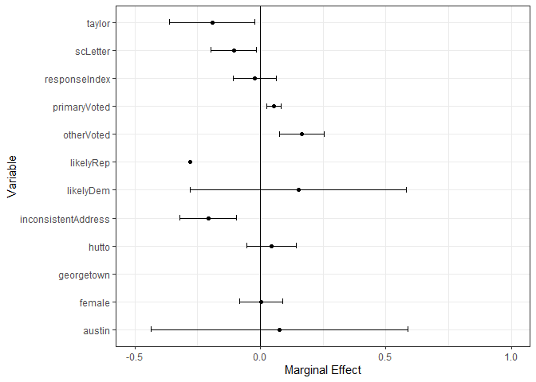
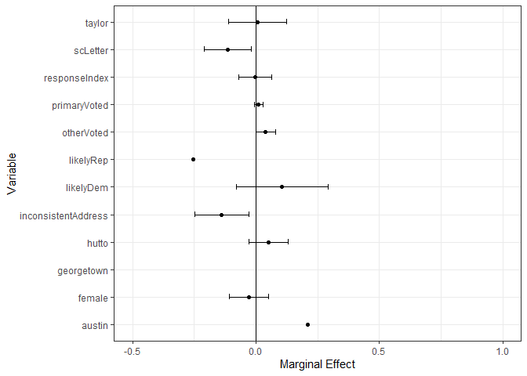
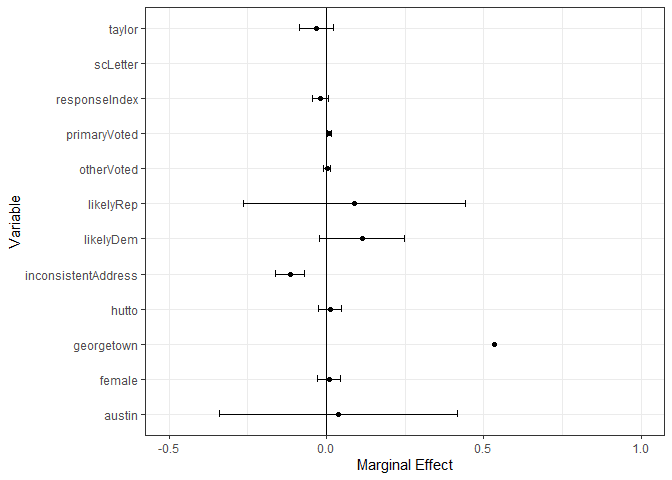
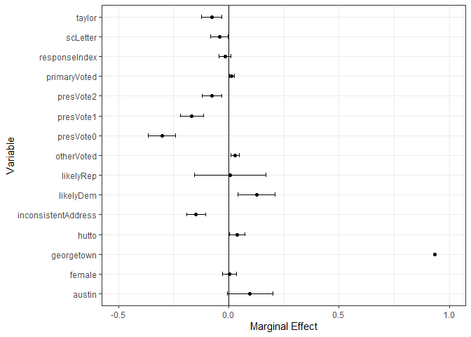

TX-HD-52
================
Madeline Kinnaird

# How effective was letter writing in Texas House District 52?

<!-- -->
# Dependent Variable

### Voted in 2020 Election

These results are as of November 17, 2020. “E voted” denotes early
voting. “Bal Ret” is mail or election day voting.

``` r
dta$voted <- (dta$VotedStatus == "E Voted"|dta$VotedStatus == "Bal Ret")
dta["voted"][is.na(dta[c("voted")])] <- FALSE
dta$voted <- as.numeric(dta$voted)
```

# Independent and Control Variables

### Counting function

``` r
create.count.index <- function(listOfColums) {
  tmpDF <- select(dta, contains(listOfColums))
  tmpList <- rowSums(!is.na(tmpDF))
  return(tmpList)
}
```

### Demographic variables

``` r
## dummy variable for Sex
dta$female = as.numeric(dta$Sex == "F")

## Dummy variables for city, "Round Rock" is omitted
dta$austin = as.numeric(dta$City == "Austin")
dta$georgetown = as.numeric(dta$City == "Georgetown")
dta$hutto = as.numeric(dta$City == "Hutto")
dta$taylor = as.numeric(dta$City == "Taylor")

## Dummy variable for leans dem or rep (control), "unknown" is omitted
dta$likelyDem = as.numeric(dta$Likely_Party_Voters == "DEM")
dta$likelyRep = as.numeric(dta$Likely_Party_Voters == "REP")
```

### Previous voting record variables

``` r
## number of total times voted since 2006
allPastElections = c("General", "Election", "Municipal", "Primary", "Runoff", "Special")
dta$pastElectionVotes <- create.count.index(allPastElections)


## number of times voted in a presidential
presidentialElections = c("General08", "General12", "General16")
dta$presidentVoted <- create.count.index(presidentialElections)


## number of times voted in a primary
primaryElections = c("Primary")
dta$primaryVoted <- create.count.index(primaryElections)


## number of times voted in any other special or municipal election
otherElections <- c(presidentialElections, primaryElections)
dta$otherVoted <- create.count.index(otherElections)
```

### Distribution of past voting (by voting type)

<!-- -->

### Responses to campaign calls/texts

``` r
## create temporary df for columns that indicate voter response
engagementCols = c("PJamesID", "GJamesID", "Vote Plan")
engagementDF <- dta[engagementCols]

## number of ways the voter responded to campaign
dta$responseIndex <- rowSums(!is.na(engagementDF))
```

### Inconsistent Addresses (mailing vs voting)

``` r
## Dummy variable for inconsistent address: 1 if inconsistent, 0 if matches
dta$inconsistentAddress <- ifelse(dta$mAddress == dta$Address, 0, 1)
```

# Modeling

From another model, I found that past election results (or some
representation of proclivity to vote) was the most impactful feature so
I wanted to figure out the best way to represent it. These models are
various model specifications/representations.

#### Specification \#1: No past votes

``` r
results1 <- glm(voted ~ scLetter +
                  likelyRep  +
                  likelyDem +
                  austin +
                  georgetown +
                  hutto +
                  taylor +
                  inconsistentAddress  +
                  responseIndex,
                data = dta, family = binomial(link = "probit"))

probitmfx(results1, data = dta, atmean = FALSE)
```

    ## Call:
    ## probitmfx(formula = results1, data = dta, atmean = FALSE)
    ##
    ## Marginal Effects:
    ##                          dF/dx  Std. Err.       z     P>|z|    
    ## scLetter             0.1731955  0.0233973  7.4024 1.338e-13 ***
    ## likelyRep            0.0915305  0.0673563  1.3589  0.174179    
    ## likelyDem            0.3133431  0.0591084  5.3012 1.151e-07 ***
    ## austin               0.0867580  0.0485806  1.7859  0.074122 .  
    ## georgetown           0.2555401  0.0089086 28.6846 < 2.2e-16 ***
    ## hutto                0.0554722  0.0183950  3.0156  0.002565 **
    ## taylor              -0.1437322  0.0299044 -4.8064 1.537e-06 ***
    ## inconsistentAddress -0.2755153  0.0300388 -9.1720 < 2.2e-16 ***
    ## responseIndex       -0.0043555  0.0153421 -0.2839  0.776495    
    ## ---
    ## Signif. codes:  0 '***' 0.001 '**' 0.01 '*' 0.05 '.' 0.1 ' ' 1
    ##
    ## dF/dx is for discrete change for the following variables:
    ##
    ## [1] "scLetter"            "likelyRep"           "likelyDem"          
    ## [4] "austin"              "georgetown"          "hutto"              
    ## [7] "taylor"              "inconsistentAddress"

#### Specification \#2: All past votes

This model would weigh all past votes equally, which doesn’t seem
representative since someone who has voted in 2 non-presidential
elections is possibly more civically engaged and likely to vote than
someone who has voted in 2 presidential elections.

``` r
results2 <- glm(voted ~ scLetter +
                  likelyRep  +
                  likelyDem +
                  austin +
                  georgetown +
                  hutto +
                  taylor +
                  inconsistentAddress  +
                  responseIndex +
                  pastElectionVotes,
                data = dta, family = binomial(link = "probit"))

probitmfx(results2, data = dta, atmean = FALSE)
```

    ## Call:
    ## probitmfx(formula = results2, data = dta, atmean = FALSE)
    ##
    ## Marginal Effects:
    ##                          dF/dx  Std. Err.       z     P>|z|    
    ## scLetter             0.0179367  0.0190825  0.9400  0.347242    
    ## likelyRep            0.0177254  0.0746766  0.2374  0.812376    
    ## likelyDem            0.1316653  0.0472117  2.7888  0.005290 **
    ## austin               0.0998095  0.0436328  2.2875  0.022167 *  
    ## georgetown           0.2569729  0.0083528 30.7648 < 2.2e-16 ***
    ## hutto                0.0505379  0.0172636  2.9274  0.003418 **
    ## taylor              -0.1040063  0.0262244 -3.9660 7.308e-05 ***
    ## inconsistentAddress -0.1717971  0.0255634 -6.7204 1.812e-11 ***
    ## responseIndex       -0.0162592  0.0144006 -1.1291  0.258869    
    ## pastElectionVotes    0.0309328  0.0017127 18.0608 < 2.2e-16 ***
    ## ---
    ## Signif. codes:  0 '***' 0.001 '**' 0.01 '*' 0.05 '.' 0.1 ' ' 1
    ##
    ## dF/dx is for discrete change for the following variables:
    ##
    ## [1] "scLetter"            "likelyRep"           "likelyDem"          
    ## [4] "austin"              "georgetown"          "hutto"              
    ## [7] "taylor"              "inconsistentAddress"

    ## `geom_smooth()` using formula 'y ~ x'

<!-- -->

#### Specification \#3: Weighted Past Votes

Here we divide up elections into presidential, primary and other.
Unsurprisingly, presidential is one of the most indicative of 2020
voting outcome.

``` r
results3 <- glm(voted ~ scLetter +
                  likelyRep  +
                  likelyDem +
                  austin +
                  georgetown +
                  hutto +
                  taylor +
                  inconsistentAddress  +
                  responseIndex +
                  presidentVoted +
                  primaryVoted +
                  otherVoted,
                data = dta, family = binomial(link = "probit"))

probitmfx(results3, data = dta, atmean = FALSE)
```

    ## Call:
    ## probitmfx(formula = results3, data = dta, atmean = FALSE)
    ##
    ## Marginal Effects:
    ##                          dF/dx  Std. Err.       z     P>|z|    
    ## scLetter            -0.0460262  0.0175917 -2.6164 0.0088874 **
    ## likelyRep            0.0012656  0.0737583  0.0172 0.9863105    
    ## likelyDem            0.1394698  0.0473474  2.9457 0.0032226 **
    ## austin               0.0888381  0.0433292  2.0503 0.0403348 *  
    ## georgetown           0.2562950  0.0154731 16.5639 < 2.2e-16 ***
    ## hutto                0.0366079  0.0166990  2.1922 0.0283641 *  
    ## taylor              -0.0855019  0.0253877 -3.3678 0.0007576 ***
    ## inconsistentAddress -0.1675757  0.0253795 -6.6028 4.035e-11 ***
    ## responseIndex       -0.0168735  0.0137042 -1.2313 0.2182255    
    ## presidentVoted       0.1001099  0.0078174 12.8060 < 2.2e-16 ***
    ## primaryVoted         0.0140446  0.0032538  4.3164 1.586e-05 ***
    ## otherVoted           0.0283490  0.0073422  3.8611 0.0001129 ***
    ## ---
    ## Signif. codes:  0 '***' 0.001 '**' 0.01 '*' 0.05 '.' 0.1 ' ' 1
    ##
    ## dF/dx is for discrete change for the following variables:
    ##
    ## [1] "scLetter"            "likelyRep"           "likelyDem"          
    ## [4] "austin"              "georgetown"          "hutto"              
    ## [7] "taylor"              "inconsistentAddress"

    ## `summarise()` regrouping output by 'presidentVoted' (override with `.groups` argument)

<!-- -->

Looking at Presidential Election voting distributions from 2006, we can
see that people who have voted in presidential elections in the past are
much more likely to have voted in the 2020 election. Next, I wanted to
see what the marginal effects for each variable was under each of these
four cases, how often people have voted in Presidential elections in the
past. To start off, I created 4 model specifications and then created a
model with 4 dummy variables.

#### Specficaition \#4: Has voted in zero previous presidential elections (since 2006)

    ##                     marginal.effect standard.error z.ratio
    ## scLetter                      0.106          0.052   2.051
    ## female                        0.032          0.048   0.663
    ## likelyRep                     0.148             NA      NA
    ## likelyDem                     0.096          0.385   0.250
    ## austin                        0.062             NA      NA
    ## georgetown                       NA             NA      NA
    ## hutto                         0.002          0.058   0.026
    ## taylor                       -0.178          0.071  -2.503
    ## inconsistentAddress          -0.134          0.067  -1.996
    ## responseIndex                -0.021          0.049  -0.433
    ## primaryVoted                  0.058          0.033   1.763
    ## otherVoted                    0.182          0.051   3.547

<!-- -->

#### Specficaition \#5: Has voted in one previous presidential election (since 2006)

    ##                     marginal.effect standard.error z.ratio
    ## scLetter                     -0.106          0.045  -2.383
    ## female                        0.004          0.043   0.091
    ## likelyRep                    -0.281             NA      NA
    ## likelyDem                     0.152          0.215   0.706
    ## austin                        0.077          0.256   0.302
    ## georgetown                    1.160             NA      NA
    ## hutto                         0.044          0.049   0.907
    ## taylor                       -0.192          0.085  -2.255
    ## inconsistentAddress          -0.208          0.056  -3.734
    ## responseIndex                -0.021          0.043  -0.482
    ## primaryVoted                  0.055          0.014   3.844
    ## otherVoted                    0.166          0.044   3.790

<!-- -->

#### Specficaition \#6: Has voted in two previous presidential elections (since 2006)

    ##                     marginal.effect standard.error z.ratio
    ## scLetter                     -0.114          0.048  -2.389
    ## female                       -0.029          0.040  -0.719
    ## likelyRep                    -0.254             NA      NA
    ## likelyDem                     0.106          0.093   1.144
    ## austin                        0.209          0.578   0.361
    ## georgetown                       NA             NA      NA
    ## hutto                         0.051          0.040   1.283
    ## taylor                        0.007          0.059   0.111
    ## inconsistentAddress          -0.139          0.055  -2.506
    ## responseIndex                -0.003          0.033  -0.100
    ## primaryVoted                  0.011          0.009   1.165
    ## otherVoted                    0.039          0.020   2.023

<!-- -->

#### Specficaition \#7: Has voted in three previous presidential elections (since 2006)

    ##                     marginal.effect standard.error z.ratio
    ## scLetter                         NA             NA      NA
    ## female                        0.009          0.018   0.475
    ## likelyRep                     0.089          0.176   0.504
    ## likelyDem                     0.113          0.067   1.674
    ## austin                        0.039          0.189   0.205
    ## georgetown                    0.535             NA      NA
    ## hutto                         0.012          0.018   0.662
    ## taylor                       -0.033          0.027  -1.198
    ## inconsistentAddress          -0.115          0.023  -5.054
    ## responseIndex                -0.019          0.013  -1.444
    ## primaryVoted                  0.010          0.003   3.337
    ## otherVoted                    0.002          0.006   0.339

<!-- -->

#### Specification \#8:

When we divide up the models by previous presidential voting, the sample
sizes get smaller for each, which is not helpful for our results. The
last specification will be turning into each the presidentialVoted index
into dummy variables.

``` r
## Dummy variables for city, "3 voted" is omitted
dta$presVote0 = as.numeric(dta$presidentVoted == 0)
dta$presVote1 = as.numeric(dta$presidentVoted == 1)
dta$presVote2 = as.numeric(dta$presidentVoted == 2)
dta$presVote3 = as.numeric(dta$presidentVoted == 3)
```

    ##                     marginal.effect standard.error z.ratio
    ## scLetter                     -0.042          0.020  -2.145
    ## female                        0.004          0.016   0.237
    ## likelyRep                     0.006          0.081   0.074
    ## likelyDem                     0.127          0.042   3.019
    ## austin                        0.097          0.052   1.846
    ## georgetown                    0.936             NA      NA
    ## hutto                         0.038          0.017   2.179
    ## taylor                       -0.077          0.023  -3.409
    ## inconsistentAddress          -0.148          0.022  -6.726
    ## responseIndex                -0.017          0.014  -1.200
    ## primaryVoted                  0.014          0.005   3.017
    ## presVote0                    -0.303          0.031  -9.859
    ## presVote1                    -0.167          0.026  -6.349
    ## presVote2                    -0.077          0.022  -3.472
    ## otherVoted                    0.029          0.009   3.135

<!-- -->
